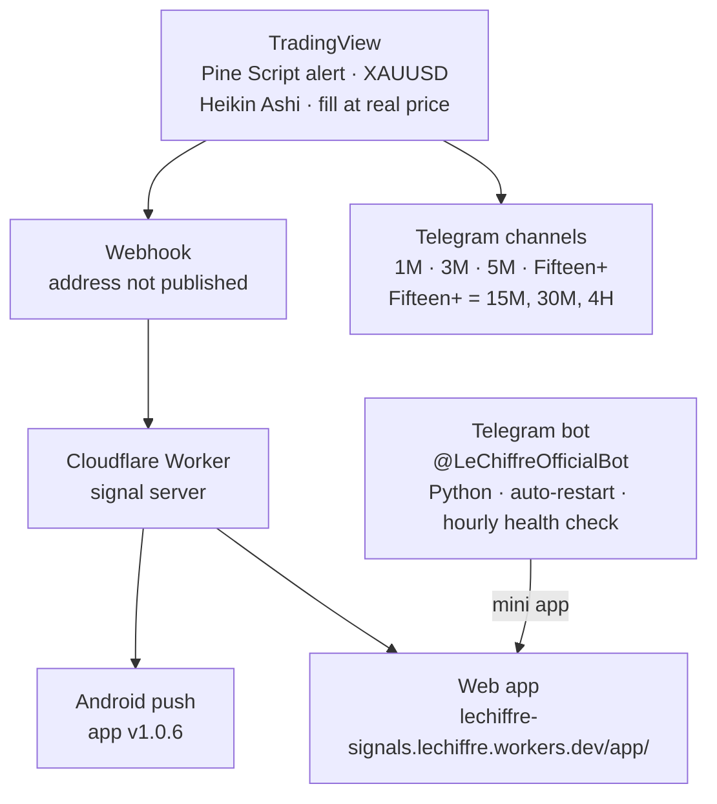
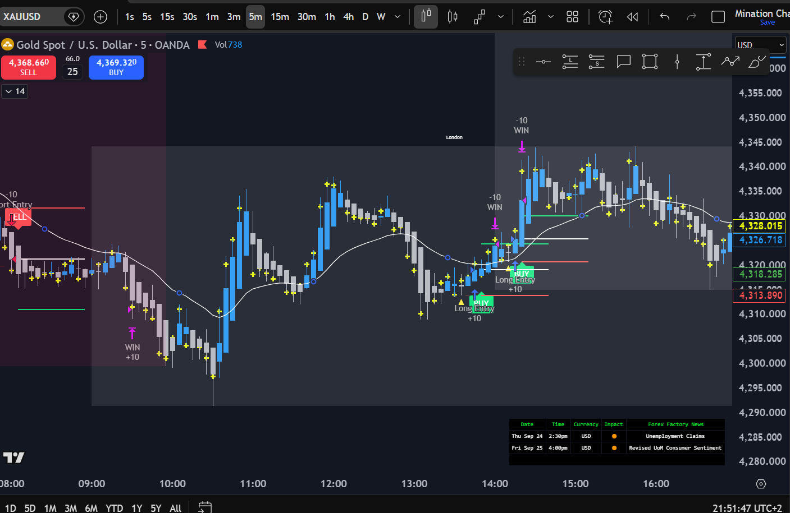
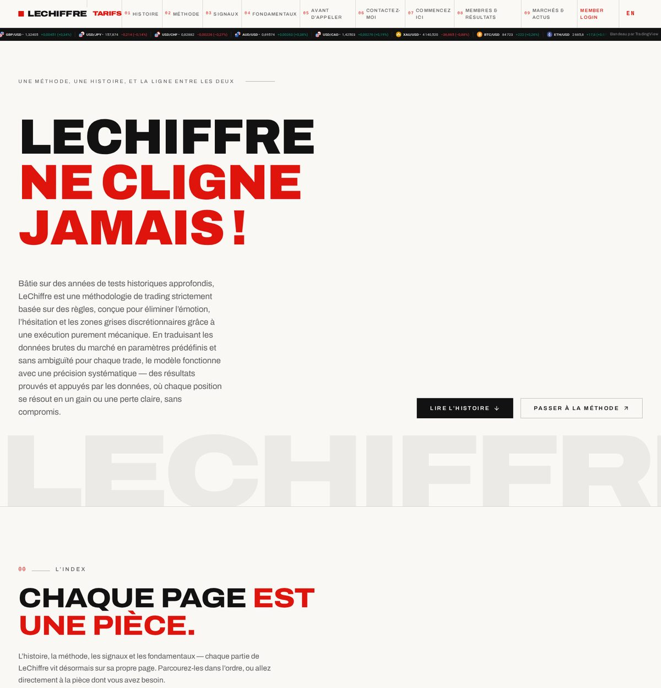
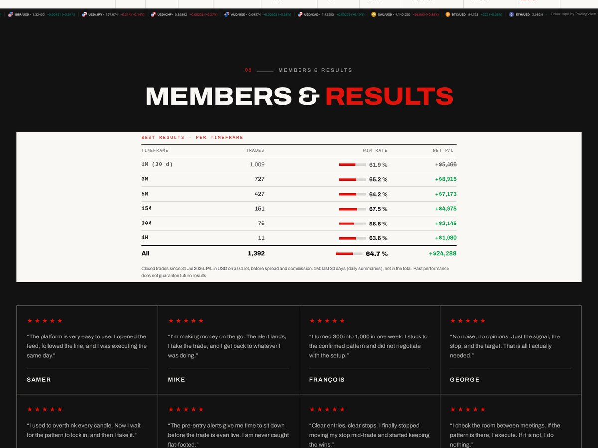
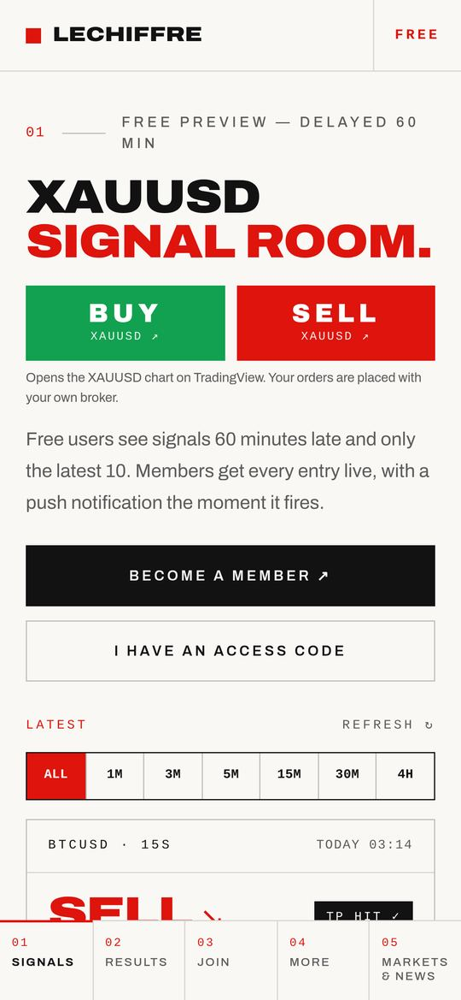
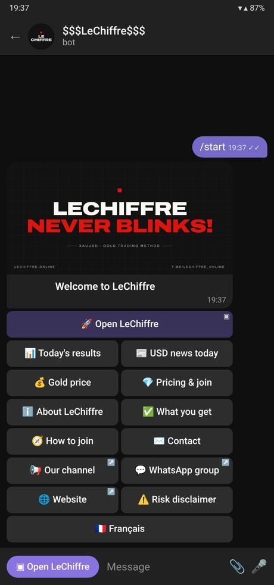

# LeChiffre — never blinks

Public portfolio for **Elie Minassian** ([e-mination](https://github.com/e-mination)): a rules-based **XAUUSD** method, the site [lechiffre.online](https://lechiffre.online/), the Android app, and the Telegram bot [@LeChiffreOfficialBot](https://t.me/LeChiffreOfficialBot).

The method is drawn in **TradingView Pine Script** on Heikin Ashi charts, with fills at the real price. Signals run on **1M, 3M, 5M, 15M, 30M, 1H, and 4H**. They are posted to Telegram channels for **1M**, **3M**, **5M**, and **Fifteen+ LeChiffre** (15M, 30M, and 4H). Membership is paid monthly or annually.

**Every P/L figure in this repository is for a 0.1 lot.** Past performance does not guarantee future results. This is not financial advice.

This repository is a showcase. It keeps the earlier Pine chart, Strategy Tester paper runs, and Telegram channel cards, and puts them next to the website, the app, and the bot. It does not contain indicator source, bot source, server source, member codes, an admin panel, webhook addresses, signing keys, or an APK.

## Links

| | |
| --- | --- |
| Method site | [https://lechiffre.online/](https://lechiffre.online/) |
| Web app | [https://lechiffre-signals.lechiffre.workers.dev/app/](https://lechiffre-signals.lechiffre.workers.dev/app/) |
| Telegram bot | [https://t.me/LeChiffreOfficialBot](https://t.me/LeChiffreOfficialBot) |
| Live portfolio | [https://e-mination.github.io/lechiffre-trading/](https://e-mination.github.io/lechiffre-trading/) |
| Support | [support@lechiffre.online](mailto:support@lechiffre.online) |
| Author | Elie Minassian · [github.com/e-mination](https://github.com/e-mination) |

The repository homepage is [lechiffre.online](https://lechiffre.online/), the method site. The live portfolio is the link above. Do not add a `CNAME` for `lechiffre.online`. That domain already serves the method site.

## How a signal moves



TradingView fires the alert. A webhook delivers it to a Cloudflare Worker. The Worker pushes the phone and updates the web app. The same method’s signals are posted to the Telegram channels. The bot is a separate Python process (`python-telegram-bot`): branded menu, today’s results, USD news, gold price, English and French, and an **Open LeChiffre** button that launches the web app inside Telegram. It auto-restarts and is health-checked every hour.

The live portfolio draws the same path in the **07 — Build** section.

## 01 — Story

LeChiffre removes the discretionary part of the gold trade. The chart is Heikin Ashi. The fill is the real price. The rules decide the entry, the stop, and the target. Three products carry that line: the website, the Android app, and Telegram.

## 02 — Method

The Pine indicator on the XAUUSD 5-minute chart: buy and sell entries, WIN tags, session shading (including London), and a Forex Factory news table.



The indicator source is not in this repository. One chart session is not a multi-month audit.

## 03 — Website

[lechiffre.online](https://lechiffre.online/) is hosted on Hostinger, in English and French.

- Story, method, signals, plans, and start here
- **Members & Results** — live results table
- **Markets & News** — TradingView widgets and the Forex Factory USD calendar
- Member login: live signals for members
- Visitors: the same room **60 minutes late**, latest 10 signals only





The plans page in these screenshots shows a one-time setup of **$200**, then **$100 per month** or **$700 per year**, paid with PayPal. Payments on that page are marked final. The live page is the price list that counts.

### Members & Results, as printed on that screenshot

Closed trades since **31 July 2026**. Net P/L in USD on a **0.1 lot**, before spread and commission. The **1M** row is the last 30 days of daily summaries and is **not** inside the All total.

| Timeframe | Trades | Win rate | Net P/L |
| --- | ---: | ---: | ---: |
| 1M (30 d) | 1,009 | 61.9% | +$5,466 |
| 3M | 727 | 65.2% | +$8,915 |
| 5M | 427 | 64.2% | +$7,173 |
| 15M | 151 | 67.5% | +$4,975 |
| 30M | 76 | 56.6% | +$2,145 |
| 4H | 11 | 63.6% | +$1,080 |
| All | 1,392 | 64.7% | +$24,288 |

P/L on a 0.1 lot. Past performance does not guarantee future results. This table is not the Strategy Tester paper grid below.

## 04 — Android app

**v1.0.6.** Google Play closed testing is in progress. No APK or app bundle is attached here. The web build of the same room:

**https://lechiffre-signals.lechiffre.workers.dev/app/**

- Live XAUUSD signals, one tab per timeframe
- A notification switch per timeframe
- **BUY** and **SELL** open the XAUUSD chart on TradingView. Orders are placed with the member’s own broker
- Results: win rate and net P/L on a **0.1 lot**, for Week, Month, and All
- Markets & News tab
- A member code works on **one device**. Codes are issued from an admin panel that is not linked from this repository
- Free preview: signals 60 minutes late, latest 10 only. Members get every entry live, with a push when it fires



P/L on a 0.1 lot. Past performance does not guarantee future results.

## 05 — Telegram

Bot: [t.me/LeChiffreOfficialBot](https://t.me/LeChiffreOfficialBot)



- Branded menu, English and French from the client language
- **Open LeChiffre** mini app (the web app, inside Telegram)
- Today’s results, USD news, gold price
- Python, `python-telegram-bot`
- Auto-restart and an hourly health check
- Bot source is not in this repository

### Channels

| Channel | What it carries |
| --- | --- |
| 1M LeChiffre | 1-minute XAUUSD signals |
| 3M LeChiffre | 3-minute signals |
| 5M LeChiffre | 5-minute signals |
| Fifteen+ LeChiffre | 15M, 30M, and 4H |

A thread prepares the setup, states the trade, records the result, and closes the day with a summary.

### Example day in the 5M screenshot

**22 September 2026.** Daily summary: 10 wins, 2 losses, 12 trades, **83.3%** win rate, net P/L **414.09** on a 0.1 lot.

One confirmed **BUY** in the same thread: signal **22/09/2026 06:30 GMT+3**, exit **06:40 GMT+3**. Entry **4344.649**, take profit **4347.778**, stop **4341.520**, risk/reward **1**. Result card: **TRADE WON**, realized P/L **31.29** on a 0.1 lot.

Image: `assets/telegram-5m-lechiffre.png`.

### Best-day reports

Positive example days only. Net P/L is for a **0.1 lot**.

| Channel | Date | Win rate | Net P/L |
| --- | --- | --- | ---: |
| 1M LeChiffre | 21/09/2026 | 65.5% (36 wins, 19 losses) | 414.08 |
| 3M LeChiffre | 18/09/2026 | 66.7% (10 wins, 5 losses) | 63.02 |
| 5M LeChiffre | 21/09/2026 | 66.7% (8 wins, 4 losses) | 143.03 |
| Fifteen+ LeChiffre | 21/09/2026 | 100% (4 wins, 0 losses) | 403.12 |

Images: `assets/telegram/`.

## 06 — Strategy Tester paper grid

TradingView Strategy Tester output for **LeChiffreXtelegram**, paper trading, **$10,000**. These screenshots are not the Members & Results table and not an audited live account. 7-day reports in this set are 1-minute, 3-minute, and 30-minute. 5-minute, 15-minute, and 4-hour are the 30-day reports. The stronger 30-day runs are 1-minute, 3-minute, 5-minute, and 15-minute.

P/L on a **0.1 lot**.

| Timeframe | Last 7 days | Last 30 days |
| --- | --- | --- |
| 1-minute | +$2,168.61 (+21.69%), WR 61.64% (188/305), PF 1.834, DD 2.48% | +$6,292.17 (+62.92%), WR 60.93% (613/1006), PF 1.61, DD 3.55% |
| 3-minute | +$713.14 (+7.13%), WR 57.58% (57/99), PF 1.399, DD 4.09% | +$5,557.94 (+55.58%), WR 64.72% (233/360), PF 1.96, DD 2.84% |
| 5-minute | Not in this set | +$3,578.92 (+35.79%), WR 65.42% (140/214), PF 1.761, DD 3.24% |
| 15-minute | Not in this set | +$3,149.55 (+31.50%), WR 71.23% (52/73), PF 2.267, DD 2.77% |
| 30-minute | +$61.17 (+0.61%), WR 54.55% (6/11), PF 1.093, DD 5.63% | +$1,765.95 (+17.66%), WR 70.59% (24/34), PF 2.276, DD 4.84% |
| 4-hour | Not in this set | +$1,478.75 (+14.79%), WR 75.00% (3/4), PF 3.349, DD 8.30% |

P/L on a 0.1 lot. Past performance does not guarantee future results.

Screenshots: `assets/strategy/`. Earlier crops of the 5-minute and 15-minute 30-day reports are `assets/strategy-30d-a.png` and `assets/strategy-30d-b.png`.

## Preview locally

From the repository root:

```bash
python3 -m http.server 8080
```

Open [http://127.0.0.1:8080/](http://127.0.0.1:8080/). Paths are relative, so the local preview matches the live portfolio.

## Live portfolio

**Live portfolio:** [https://e-mination.github.io/lechiffre-trading/](https://e-mination.github.io/lechiffre-trading/)

Plain HTML, CSS, and images at the repository root. [`.nojekyll`](.nojekyll) is present so the files are served as they are. The method site stays at [lechiffre.online](https://lechiffre.online/).

## Repository layout

```
index.html                 Portfolio
gallery.html               Screenshot gallery
css/styles.css             Styles, matched to lechiffre.online
assets/showcase/           Website, app, and bot screenshots
assets/fonts/              Archivo and IBM Plex Mono (SIL OFL)
assets/strategy/           Strategy Tester paper screenshots
assets/telegram/           Best-day channel summaries
assets/tradingview-indicator-xauusd.png
assets/telegram-5m-lechiffre.png
LICENSE                    MIT, for this site’s source
```

## Screenshots

| File | What it is |
| --- | --- |
| `assets/showcase/website-fr-hero.jpg` | French homepage header and hero |
| `assets/showcase/website-members.jpg` | Members & Results |
| `assets/showcase/website-home-hero.jpg` | English homepage |
| `assets/showcase/website-plans.jpg` | Plans |
| `assets/showcase/website-markets.jpg` | Markets & News |
| `assets/showcase/app-signals.jpg` | App Signals, with BUY and SELL |
| `assets/showcase/bot-menu-en.jpg` | Telegram bot welcome menu |
| `assets/tradingview-indicator-xauusd.png` | Pine indicator on XAUUSD, 5-minute |
| `assets/strategy/` | Strategy Tester paper grid |
| `assets/telegram/` | Best-day summaries: 1M, 3M, 5M, Fifteen+ |
| `assets/telegram-5m-lechiffre.png` | 5M thread: pre-entry, entry, result, daily summary |

## License and contact

Source of this site (HTML, CSS, SVG) is released under the [MIT License](LICENSE).

Archivo and IBM Plex Mono are under the SIL Open Font License. See `assets/fonts/Archivo-OFL.txt` and `assets/fonts/IBMPlexMono-OFL.txt`.

**Elie Minassian** — [support@lechiffre.online](mailto:support@lechiffre.online) — [github.com/e-mination](https://github.com/e-mination)
